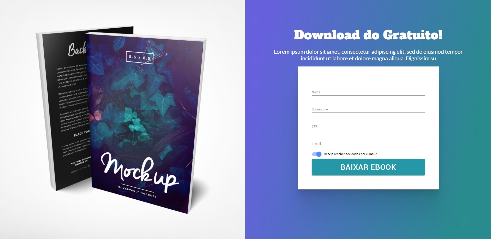

# React Download eBook Page

<h1 align="center">React Download eBook Page</h1>

This is a responsive project inspired by <a href="https://github.com/alura-cursos/1897-react-functions/tree/aula5">Formação React Alura</a>

### Features

- [ ] 
- [ ] 
- [ ] 
- [ ] 

<h1 align="center">
  
</h1>
